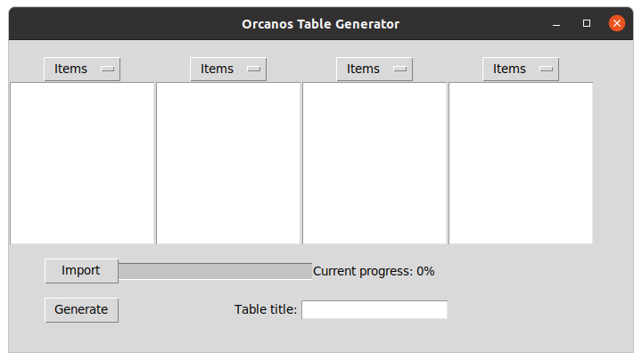
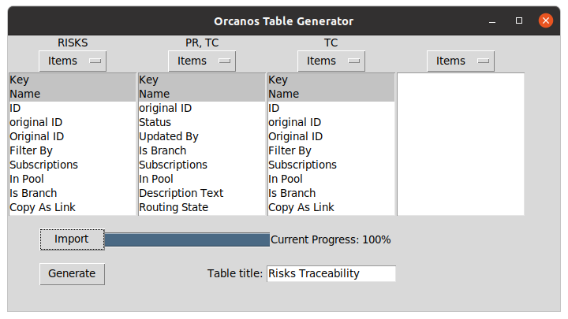

#### 'orcanos_export'

`orcanos_export` is a viewer of the orcanos database. It uses orcanos_api to interact with the server and fetch data.

```
$ python orcanos_export.py -h
usage: orcanos_export.py [-h] [-t TRACEA] [-f OUTPUT_FILENAME] [-p PROJECT] [-x XML [XML ...]]

optional arguments:
  -h, --help            show this help message and exit
  -t TRACEA, --tracea TRACEA
                        'PR-TC', 'PR-SRS' or 'PR-SRS.MECRS.ELCRS'
  -f OUTPUT_FILENAME, --output_filename OUTPUT_FILENAME
                        HTML format, default is 'output.html'
  -p PROJECT, --project PROJECT
                        Project can be 'Eve' or 'Atalante'
  -x XML [XML ...], --xml XML [XML ...]
                        list of xml test files from CI. Ex: file1.xml file2.xml

```

Where for TRACEA:
- 'PR-TC' will look at all the PR and the TC children incuding test results.
- 'PR-SRS' will look at all the PR and the SRS children.

Example of command line using orcanos_api:

```
python orcanos_export.py -f output.html -p Eve --xml test_data/srs_test_report.xml
```

```
python orcanos_export.py -t PR-TC -f output.html -p Eve
```


#### 'xunit_export'

This script purpose is to extract tables from xunit xml files (generally coming from CI jobs artefacts) is order to build software test plans and test reports

```
$ python xunit_export.py -h
usage: xunit_export.py [-h] -o OUTPUT_TYPE [-f OUTPUT_FILENAME] -x XML [XML ...]

optional arguments:
  -h, --help            show this help message and exit
  -o OUTPUT_TYPE, --output_type OUTPUT_TYPE
                        Can be 'Plan\ or 'Report' with results
  -f OUTPUT_FILENAME, --output_filename OUTPUT_FILENAME
                        HTML format, default is 'output.html'
  -x XML [XML ...], --xml XML [XML ...]
                        list of xml test files from CI. Ex: file1.xml file2.xml

```

```
 python xunit_export.py -o Plan -f output.html --xml test_data/srs_test_report.xml
 python xunit_export.py -o Report -f output.html --xml test_data/srs_test_report.xml

```
#### 'orcanos_gui'

To launch the interface run the following script :

```
python orcanos_gui.py
```



- Select the traceability items in each column (multiple items can be selected per column).
- Note that items in the last columns will be displayed as a list in one cell, for the previous columns each link will be displayed as one row.
- TC items (Test Cases) will automatically display its pass or fail result.




- Click on the `Import` button to import the work items from the Orcanos database.
- If you wish, write a title in the `Table title` text box for your generated table. 
- Finally, click on the `Generate` button to save your html file containing the generated traceability table.
